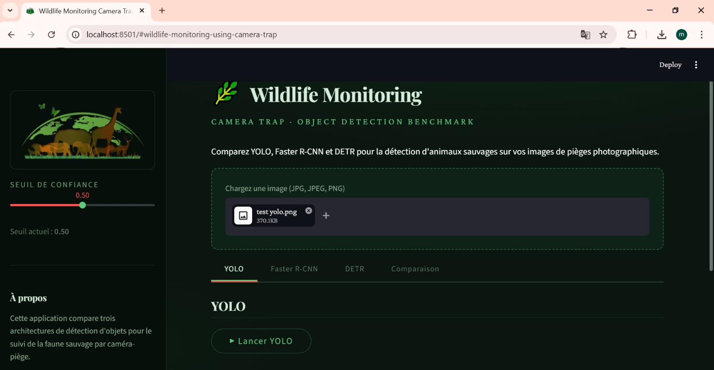
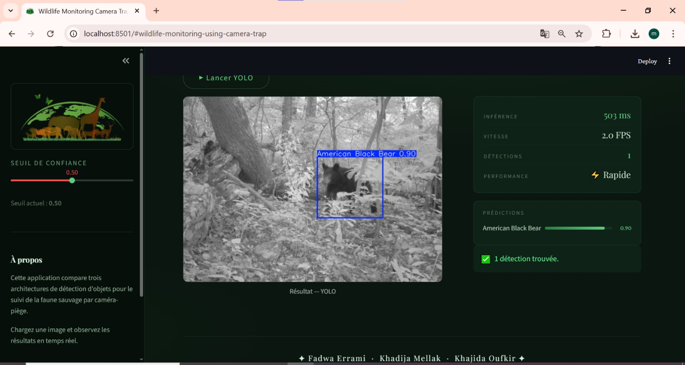

# 🐾 Wildlife Monitoring System using Camera Trap Images

An AI-powered computer vision system for automatic detection and classification of wildlife species using deep learning models such as YOLO, Faster R-CNN, and Transformer-based architectures.

  

---
<p align="center">
  <br>
  
</p>


---


## Models

| Model | Color | Type | Backend |
|-------|-------|------|---------|
| **YOLO** | 🟢 Green `(0,255,0)` | Single-stage | Ultralytics |
| **Faster R-CNN** | 🔵 Blue `(255,0,0)` | Two-stage | torchvision |
| **DETR** | 🟣 Magenta `(255,0,255)` | Transformer | ResNet-50 |

- **YOLO** — fast single-stage detector optimized for real-time inference.
- **Faster R-CNN** — two-stage detector; higher accuracy at the cost of speed.
- **DETR** — transformer-based detection with global reasoning and a simplified pipeline.

---

## Features

- Upload `jpg`, `jpeg`, or `png` images directly in the UI
- Four tabs: **YOLO**, **Faster R-CNN**, **DETR**, **Compare All**
- Each individual tab includes a **Run** button and annotated output
- **Compare All** runs all three models simultaneously, displays results in 3 columns, and renders a performance ranking table
- Distinct bounding box colors per model for easy visual comparison
- Model caching — no reload on every interaction
- Inference latency display with optional FPS metric

---

## Installation

### Recommended — Conda

```bash
conda activate facerec
pip install -r requirements.txt
```

### Alternative — Virtualenv

```bash
python -m venv venv
venv\Scripts\activate       # Windows
# source venv/bin/activate  # macOS / Linux
pip install -r requirements.txt
```

---

## Run the app

```bash
streamlit run app.py
```

---

## Project structure

```
object-detection-benchmark/
├── app.py
├── utils.py
├── requirements.txt
├── README.md
├── .gitignore
├── models/
│   ├── yolo.py
│   ├── faster_rcnn.py
│   └── detr.py
├── weights/               ← place .pt / .pth files here
└── notebooks/
    ├── 1_yolo_inference.ipynb
    ├── 2_fasterrcnn_inference.ipynb
    └── 3_detr_inference.ipynb
```

---

## Weights & checkpoints

| Model | Local path | Fallback |
|-------|-----------|---------|
| YOLO | `weights/yolo.pt` or `weights/best.pt` | **required** |
| Faster R-CNN | `weights/fasterrcnn_sgd_aug_best.pt` / `.pth` | torchvision default (auto-download) |
| DETR | `weights/DETR (DEtection TRansformer)/best_model` | torchvision default (auto-download) |

> If a valid local checkpoint is present, the app loads it automatically instead of the default weights.

---

## Notebooks

Each notebook is standalone and runs one model's inference pipeline.

**Sample image lookup order:**
1. `../sample.jpg`
2. First `.jpg`, `.jpeg`, or `.png` found in the repository root

**Output files:**

```
yolo_result.jpg
fasterrcnn_result.jpg
detr_result.jpg
```

---

## Notes

- Compatible with **Python 3.9+**
- Designed for quick benchmarking and visual model comparison
- YOLO requires a local `.pt` weight file — no automatic download
- Faster R-CNN and DETR download default weights on first run if no local checkpoint is found